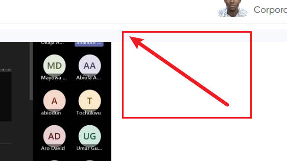

# Devops_L1 Poject implementation
this project will b we implementing some basic linus project

## Sudo Command

the sub sudo command is also known as super user command which is used to grant.

to use the sudo command sythax `sudo apt upgrade`

## PWD COMMAND

HDHDHFHFHFHFHHDHDDHDHDHHDDH

Welcome Sir@ROYALPEDA-CONSULTING MINGW64 ~/Devops_L1 (main)

